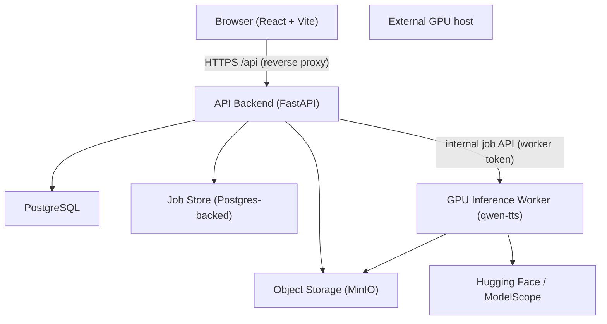
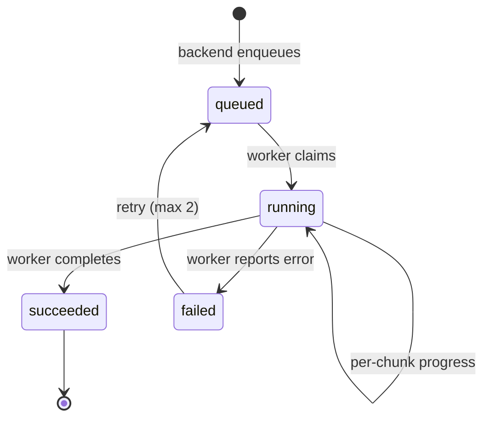

# Voice Studio - Technical Architecture & Implementation Plan

Source of truth: `reference/Voice_Studio.ipynb` (the demonstrated Qwen3-TTS workflow).
Companion references: the official `qwen-tts` package (PyPI `qwen-tts`, latest `0.1.1`) and the Qwen3-TTS repository README.

This document only specifies what has been **proven** to work in the reference notebook or is directly documented in the official `qwen-tts` package. Anything else is explicitly marked as *not demonstrated* and is out of scope.

---

## 1. Executive Summary

The reference notebook proves a complete, working TTS pipeline built on Qwen3-TTS:

1. **Voice design**: `Qwen3-TTS-12Hz-1.7B-VoiceDesign` synthesizes a reference clip from a natural-language voice description plus a short reference text. A human listens and approves/rejects it.
2. **Voice persistence**: The approved reference clip and its metadata are stored under a named voice.
3. **Reusable voice prompt**: `Qwen3-TTS-12Hz-1.7B-Base` converts the reference clip into a reusable clone prompt (a serializable tensor bundle), so future generations do not re-extract voice features.
4. **Narration generation**: Text is split into ~80-word chunks, each chunk is synthesized with the clone prompt, and the chunk WAVs are concatenated into a final WAV.

All model operations require a **CUDA GPU** (the notebook runs on a Google Colab T4). The target deployment environment for the web application **has no GPU** (2 CPUs, ~7.8 GB RAM). Therefore the architecture is a **two-tier split**:

- **Web application tier** (this environment): frontend, HTTP API backend, relational database, object storage, job orchestration. No PyTorch, no `qwen-tts`.
- **GPU inference tier** (external GPU host): a dedicated worker service that wraps the exact, notebook-proven `qwen-tts` calls. The two tiers communicate only through a narrow, authenticated job API.

---

## 2. Environment & Constraints

| Fact | Value |
| --- | --- |
| Current workspace hardware | 2 CPUs, ~7.8 GB RAM, no CUDA GPU, ~20 GB disk |
| Reference notebook runtime | Google Colab, CUDA GPU (T4 mentioned: *"may take a little while on the T4"*), Google Drive for persistence |
| PyPI package | `qwen-tts` (0.1.1) |
| Models (verified via Hugging Face API) | `Qwen/Qwen3-TTS-12Hz-1.7B-VoiceDesign` and `Qwen/Qwen3-TTS-12Hz-1.7B-Base`; ~1.93B params, BF16, ~4.5 GB on disk each |
| Preview platform | Exposes a single HTTP port; a frontend reverse proxy is required |

Consequences that shape the architecture:

- The web application **cannot** run inference locally. It must delegate to a GPU worker.
- GPU worker memory: each 1.7B model requires ~4-5 GB VRAM for weights plus activation/KV-cache headroom. A 16 GB T4 is the demonstrated baseline. The notebook never holds both 1.7B models in memory simultaneously.
- Model weights are downloaded from Hugging Face / ModelScope on first use; the GPU host must have network access and ~9-10 GB of free disk for both checkpoints.

---

## 3. What the Reference Notebook Actually Proves

### 3.1 The proven workflow (cell by cell)

| Notebook cell | Operation | Layer | Proven |
| --- | --- | --- | --- |
| 1 | Check GPU via `nvidia-smi` | GPU host | Yes |
| 3 | Mount Google Drive (persistence) | Environment | Yes (Colab-specific, replaced by storage below) |
| 5 | Create workspace dirs `models/`, `voices/`, `output/` | Host | Yes |
| 7 | `pip install -U qwen-tts` | GPU host | Yes |
| 9 | Import `Qwen3TTSModel`, check `torch.cuda.is_available()` | GPU host | Yes |
| 11 | Load VoiceDesign: `Qwen3TTSModel.from_pretrained("Qwen/Qwen3-TTS-12Hz-1.7B-VoiceDesign", device_map="cuda:0", dtype=torch.bfloat16)` | GPU | Yes |
| 13 | Define `VOICE_NAME`, `voice_description`, `reference_text`, `VOICE_LANGUAGE` | CPU | Yes |
| 15 | `design_model.generate_voice_design(text=..., language=..., instruct=...)` -> `(wavs, sr)`; write preview WAV; human approve/reject loop | GPU + human | Yes |
| 17 | Save `reference.wav`, `description.txt`, `reference_text.txt`; then `del design_model`, `gc.collect()`, `torch.cuda.empty_cache()` to free VRAM | CPU + GPU | Yes |
| 19 | Load Base: `Qwen3TTSModel.from_pretrained("Qwen/Qwen3-TTS-12Hz-1.7B-Base", device_map="cuda:0", dtype=torch.bfloat16)` | GPU | Yes |
| 21 | `clone_model.create_voice_clone_prompt(ref_audio=<wav path>, ref_text=<str>)` -> list of prompt items | GPU | Yes |
| 23 | Inspect prompt item attributes | CPU | Yes |
| 25 | Save prompt as `{icl_mode, ref_code(cpu), ref_spk_embedding(cpu), ref_text, x_vector_only_mode}` via `torch.save` | CPU | Yes |
| 27 | `torch.load(weights_only=True)`; **asserts** `ref_code.shape == (108, 16)`, `ref_spk_embedding.shape == (2048,)`, `icl_mode is True`, `x_vector_only_mode is False` | CPU | Yes |
| 29 | Restore `VoiceClonePromptItem` from `qwen_tts.inference.qwen3_tts_model`, tensors moved to the model's device | GPU | Yes |
| 32/36 | `clone_model.generate_voice_clone(text=..., language="English", voice_clone_prompt=[item])` inside `torch.inference_mode()` -> `(wavs, sr)`; `sf.write(wavs[0], sr)` | GPU | Yes |
| 46 | Chunking: split on blank lines (`re.split(r"\n\s*\n")`), then sentences (`re.split(r"(?<=[.!?])\s+")`), greedy packing up to `MAX_WORDS_PER_CHUNK = 80` | CPU | Yes |
| 48 | Generate each chunk to `chunk_%03d.wav`, record per-chunk duration | GPU | Yes |
| 50 | `np.concatenate` chunks, verify consistent sample rate, write `final_narration.wav` | CPU | Yes |
| 55 | `generate_narration(text, output_name, max_words_per_chunk=80)` — the full reusable function (validate -> chunk -> generate each chunk -> combine) | CPU + GPU | Yes |
| 62/66/70 | Punctuation and intonation experiments (`normal/question/ellipsis/exclamation`, natural-intonation variants) | GPU | Yes (qualitative finding: punctuation and line breaks influence pacing/emphasis) |

### 3.2 Verified package API contract

Confirmed against PyPI `qwen-tts` and the official Qwen3-TTS README (same version family the notebook installs with `pip install -U qwen-tts`):

- `Qwen3TTSModel.from_pretrained(model_id, device_map="cuda:0", dtype=torch.bfloat16)` loads a model. `attn_implementation="flash_attention_2"` is documented as optional and reduces VRAM (requires compatible hardware; not used in the notebook).
- `model.generate_voice_design(text, language, instruct)` -> `(wavs, sr)`. `language` is one of the 10 supported languages or `"Auto"`.
- `model.create_voice_clone_prompt(ref_audio, ref_text, x_vector_only_mode=False)` -> list of prompt items.
- `model.generate_voice_clone(text, language, voice_clone_prompt=<list>)` -> `(wavs, sr)`. Runs under `torch.inference_mode()`.
- `VoiceClonePromptItem` (module `qwen_tts.inference.qwen3_tts_model`) fields: `icl_mode` (bool), `ref_code` (tensor `(108, 16)`), `ref_spk_embedding` (tensor `(2048,)`), `ref_text` (str), `x_vector_only_mode` (bool).
- `wavs` is a list of 1-D numpy arrays; `sr` is the sample rate **returned by the model** — the code must not assume a fixed rate.
- Output is written with `soundfile` (`sf.write(path, wavs[0], sr)`), i.e. standard WAV.
- Models support 10 languages: Chinese, English, Japanese, Korean, German, French, Russian, Portuguese, Spanish, Italian.
- The model family also includes `Qwen3-TTS-12Hz-1.7B/0.6B-CustomVoice` (9 premium timbres with `generate_custom_voice`) and `Qwen3-TTS-12Hz-0.6B-*` variants.

### 3.3 The persistence contract (cross-boundary)

The reusable voice prompt is the key artifact that crosses the web-app / GPU boundary. The notebook defines its exact shape:

```python
saved_prompt = {
    "icl_mode": True,                      # bool
    "ref_code": torch.Tensor(108, 16),     # on CPU after detach()
    "ref_spk_embedding": torch.Tensor(2048,),  # on CPU after detach()
    "ref_text": "<reference transcript>",  # str
    "x_vector_only_mode": False,           # bool
}
```

- Persisted with `torch.save` (a `.pt` file) and loaded with `torch.load(..., map_location="cpu", weights_only=True)`.
- Restored with `VoiceClonePromptItem(...)`, tensors moved to the model device.
- The `.pt` file is **opaque to the web tier**: the web tier only stores and retrieves the bytes. Only the GPU worker interprets it. This is the core of the boundary.

Voice folder layout (notebook cells 17/25/40):

```
voices/<VOICE_NAME>/
├── reference.wav
├── description.txt
├── reference_text.txt
├── voice_clone_prompt.pt
└── narrations/
    ├── <output_name>/
    │   ├── chunks/chunk_001.wav ...
    │   └── <output_name>.wav
```

### 3.4 What is NOT demonstrated (do not build in v1)

These are documented in the README or elsewhere but **do not appear in the reference notebook** and must not be treated as proven:

- **Streaming / low-latency generation** (README claims Dual-Track streaming with 97 ms first-packet; the notebook only uses blocking `generate_*` calls).
- **`CustomVoice` premium timbres** and `generate_custom_voice`.
- **Batch inference** (README shows `text=[...]` list inputs; notebook is always single-call).
- **Voice cloning from arbitrary uploaded audio or from URL/base64 refs** (README documents `ref_audio` accepting path/URL/base64/tuple; the notebook only clones from a voice-design-generated reference clip).
- **`x_vector_only_mode=True`** (notebook always uses full ICL mode).
- **vLLM-Omni serving** (offline only per README).
- **Fine-tuning**, **DashScope hosted API**, **tokenizer encode/decode** for transport.
- Any quality/performance numbers on specific hardware (only "works on a T4" is implied).

---

## 4. What Must Run on a GPU

Every operation that touches model weights or does inference **must run on a CUDA GPU** with the `qwen-tts` package installed:

| Operation | Model | GPU required |
| --- | --- | --- |
| `generate_voice_design` (voice design preview) | VoiceDesign 1.7B | Yes |
| `create_voice_clone_prompt` (feature extraction from reference audio) | Base 1.7B | Yes |
| `generate_voice_clone` (per-chunk synthesis) | Base 1.7B | Yes |
| Model load/unload, `torch.inference_mode()` forward passes, VRAM management | both | Yes |

CPU-only work (safe on the web tier): text validation, chunking, WAV I/O with `soundfile`, numpy concatenation, metadata (sample rate, duration), serving audio files, and all web/DB/storage logic.

GPU memory plan (mirrors notebook): keep the Base model resident for clone-prompt creation and narration. Load the VoiceDesign model only while processing a design job, then release it (`del` + `gc.collect()` + `torch.cuda.empty_cache()`), exactly as notebook cells 11 and 17 do. On a 16 GB T4 both models fit simultaneously (~8-9 GB weights), but the notebook discipline of one-at-a-time remains the safe default and the documented fallback for smaller GPUs.

---

## 5. System Architecture



- **Tier 1 - Web application** (this environment): browser frontend, FastAPI backend, PostgreSQL, object storage, job queue. No `torch`, no `qwen-tts`.
- **Tier 2 - GPU inference** (external GPU host): a single-process worker that loads the Base model at startup, loads VoiceDesign on demand, downloads input artifacts, runs the exact notebook-proven calls, and uploads output WAVs.

The two tiers never share a database or filesystem. The worker is a dumb executor: the backend decides what to do and the worker reports results. All durable state lives in the web tier.

---

## 6. Component Design

### 6.1 Frontend

- **Stack**: React + TypeScript + Vite (satisfies the frontend-reverse-proxy rule; Vite dev server proxies `/api` to the backend and sets `allowedHosts: ['.monkeycode-ai.live']`).
- **Screens** (only features backed by demonstrated capability):
  - **Auth**: login / register.
  - **Voice library**: list the current user's voices with their description, reference text, and a playable preview (`reference.wav`).
  - **Voice design wizard**: inputs for voice description, reference text, and language (whitelist of the 10 supported languages). Submit -> poll job -> preview audio player -> **Approve** (creates the clone prompt) or **Redesign** (re-runs with edited description). Mirrors notebook cells 13-17.
  - **Narration studio**: a script textarea with client-side word/character count and empty-check, a chunk preview (backend returns the chunking result), submit -> per-chunk progress -> final `<audio>` player -> download WAV. Mirrors notebook cells 22-28.
  - **Job status**: poll the backend for job state (queued/running/succeeded/failed); simple status bar, no websockets in v1.
- **State**: plain React state + a small API client module. No state library needed for v1.

### 6.2 Backend API

- **Stack**: Python 3.11 + FastAPI (Uvicorn). Python is chosen so the chunking logic and the prompt-serialization contract can be unit-tested against the notebook's exact logic, and so the backend can re-use `soundfile`/`numpy` for the concatenation step without pulling in PyTorch.
- **Responsibilities**: authentication, voice/job/narration records, chunking (CPU), enqueueing jobs, storing artifacts, concatenating chunk WAVs, serving audio.
- **Endpoints**:

| Method & path | Purpose | Notes |
| --- | --- | --- |
| `POST /api/auth/register`, `POST /api/auth/login`, `POST /api/auth/refresh` | Auth | JWT |
| `GET /api/voices` | List user's voices | |
| `POST /api/voices` | Create voice record (draft) | |
| `GET /api/voices/{id}` | Voice detail incl. preview URL | |
| `DELETE /api/voices/{id}` | Delete a voice | owner only |
| `POST /api/voices/{id}/design` | Enqueue voice-design job (description, ref text, language) | returns job id |
| `POST /api/voices/{id}/approve` | Approve a design preview; enqueue clone-prompt job | |
| `POST /api/voices/{id}/narrations` | Enqueue narration job (script text) | backend chunks |
| `GET /api/jobs/{id}` | Job status incl. progress and per-chunk info | polled by frontend |
| `GET /api/narrations/{id}` | Narration detail incl. audio URL | |
| `GET /api/files/{key}` | Stream audio/WAV file (auth-checked) | |
| `POST /api/internal/jobs/poll` | Worker: claim next queued job | worker-token protected |
| `POST /api/internal/jobs/{id}/progress` | Worker: report progress | worker-token protected |
| `POST /api/internal/jobs/{id}/complete` / `/fail` | Worker: report result | worker-token protected |

### 6.3 Database (PostgreSQL; SQLite in local dev/tests)

```sql
users        (id uuid PK, email unique, password_hash, created_at)
voices       (id uuid PK, owner_id FK users, name, language,
              description text, reference_text text,
              status enum(draft|preview_ready|approved),
              preview_ref_audio_key, prompt_pt_key,
              created_at, updated_at)
jobs         (id uuid PK, owner_id FK users, type enum(design|clone_prompt|narration),
              status enum(queued|running|succeeded|failed),
              voice_id FK, narration_id FK nullable,
              payload jsonb, result jsonb, progress int default 0,
              attempts int default 0, error text,
              created_at, updated_at)
narrations   (id uuid PK, owner_id FK users, voice_id FK,
              script text, chunks jsonb, final_audio_key,
              sample_rate int, duration_sec float, status,
              created_at)
```

The `jobs` table is also the **job queue**: status `queued` -> worker claims by atomic update (`UPDATE ... SET status='running' WHERE id=(SELECT id FROM jobs WHERE status='queued' AND type=? LIMIT 1 FOR UPDATE SKIP LOCKED)`). This needs no broker infrastructure and works across the two-tier network since the worker talks to the backend, not the DB.

### 6.4 Storage (Object Storage)

- **Artifacts** (all opaque blobs, keyed by UUID):
  - `voices/{voice_id}/reference.wav` — approved design preview
  - `voices/{voice_id}/voice_clone_prompt.pt` — the reusable prompt (opaque to web tier)
  - `narrations/{narration_id}/chunk_{i}.wav` — per-chunk output
  - `narrations/{narration_id}/final.wav` — concatenated output
- **Implementation**: local filesystem-backed store in dev/preview (mirrors the notebook's `voices/` + `output/` layout and the existing `.gitignore` entries for `data/`, `uploads/`, `storage/`); MinIO/S3 for production. The backend hands out short-lived, signed download URLs to both the browser and the GPU worker.

### 6.5 Authentication & Authorization

- **Mechanism**: email + password; passwords hashed with Argon2id; short-lived access JWT + refresh token. No roles in v1 (all users are equals).
- **Authorization**: every voice/narration/job is scoped to `owner_id`; all read/write endpoints enforce ownership server-side (never trust client-supplied ids).
- **Worker authentication**: a separate, long-lived worker token (not a user JWT) required on all `/api/internal/*` routes, and the internal routes are additionally firewalled to the GPU host's IP where possible.

### 6.6 Job Orchestration

- Backend state machine: `queued -> running -> succeeded | failed`.
- Frontend polls `GET /api/jobs/{id}` (2 s interval). No SSE/websockets in v1.
- Per-chunk narration: the backend splits the script (identical logic to notebook cell 46/55) and stores the chunk list on the narration; the worker loops over chunks in a **single** job, reporting `progress = chunk_index / total_chunks`. Failed chunks retry up to 2 attempts within the job.
- The worker never holds user data: it receives artifact references (signed URLs) and returns output references.

### 6.7 GPU Inference Worker

- **Stack**: Python 3.11 + `qwen-tts` + PyTorch (CUDA build) + `huggingface_hub` (or ModelScope mirror); single process, single GPU.
- **Startup**: load Base model (`device_map="cuda:0"`, `dtype=bfloat16`). It stays resident.
- **Job loop**:
  1. Poll `POST /api/internal/jobs/poll` with the worker token; on empty, sleep (e.g. 2 s).
  2. Download input artifacts (reference WAV or prompt `.pt`) via signed URLs.
  3. Dispatch by type:
     - **design**: load VoiceDesign model (if not already loaded), call `generate_voice_design`, write preview WAV, release VoiceDesign model (notebook cell 17 discipline).
     - **clone_prompt**: load saved prompt dict with `torch.load(weights_only=True)`, rebuild `VoiceClonePromptItem` on the GPU (notebook cells 27/29), call `create_voice_clone_prompt` — actually the prompt is created from `reference.wav` + `reference_text.txt` (notebook cell 21); serialize with the notebook cell-25 schema and upload the `.pt`.
     - **narration**: download the `.pt` prompt, restore `VoiceClonePromptItem`, for each chunk call `generate_voice_clone(text, language, voice_clone_prompt)` under `torch.inference_mode()`, write each chunk WAV (notebook cell 48), upload chunk WAVs, report progress per chunk.
  4. Report `complete` (with artifact references and `sample_rate`) or `fail` (with error message). The backend concatenates chunks and records duration.
- **Concurrency**: one job at a time per GPU (single-process serial loop). No batching in v1. Multi-GPU/queue scaling is a documented future extension, not demonstrated behavior.

---

## 7. The Web Application / GPU Inference Boundary

### 7.1 Trust boundary

- The GPU worker is **outside** the web tier's trust zone. It:
  - must not access the web database directly;
  - receives work only via the authenticated internal API;
  - is the only component with access to model weights and the only place `qwen-tts`/`torch` runs;
  - must never be exposed to the public internet (listen on a private interface, or require mTLS / VPN).
- The web tier treats the `.pt` prompt and WAV files as opaque bytes. The only structured contract shared across the boundary is: (a) job request payloads, (b) the notebook cell-25 prompt schema, (c) `(wavs, sr)` semantics, (d) chunk ordering for concatenation.

### 7.2 Job lifecycle



### 7.3 Backend <-> worker contract (payloads)

Design job payload:
```json
{ "type": "design", "voice_id": "...", "language": "English",
  "instruct": "<voice description>", "text": "<reference text>",
  "output_ref_audio_url": "<signed url to write preview wav>" }
```

Clone-prompt job payload:
```json
{ "type": "clone_prompt", "voice_id": "...",
  "ref_audio_url": "<signed url>", "ref_text": "...",
  "output_prompt_url": "<signed url to write .pt>" }
```

Narration job payload:
```json
{ "type": "narration", "voice_id": "...", "language": "English",
  "prompt_url": "<signed url of voice_clone_prompt.pt>",
  "chunks": ["chunk text 1", "chunk text 2", "..."],
  "output_dir_url": "<signed base url to upload chunk wavs>" }
```

Complete result:
```json
{ "job_id": "...", "chunk_files": ["<key>", "..."],
  "sample_rate": 24000, "chunk_durations": [3.2, ...] }
```

The sample rate and per-chunk durations come from the worker (the model returns `sr`); the backend stores them as metadata and never assumes a fixed rate.

---

## 8. TTS Inference Architecture (mapping the notebook to services)

| Notebook step | Web application | GPU worker |
| --- | --- | --- |
| Cells 13/15 (describe + design) | Voice design form -> design job | `generate_voice_design` |
| Cell 15 (approve/reject) | Preview player + Approve/Redesign | - |
| Cells 17 (save voice) | Store `reference.wav`, `description.txt`, `reference_text.txt`; set voice `preview_ready` | - |
| Cell 21 (clone prompt) | Enqueue clone-prompt job on approve | `create_voice_clone_prompt` |
| Cells 25/27/29 (prompt persistence) | Store `.pt`; voice -> `approved` | Serialize/restore `VoiceClonePromptItem` |
| Cell 46 (chunking) | Backend chunks script (same regex logic) | - |
| Cells 48 (per-chunk synth) | - | `generate_voice_clone` per chunk |
| Cell 50 (concatenate) | Backend concatenates chunk WAVs, records duration | - |
| Cells 41-42, 52-53, 59-60, 63-64, 68, 72 (playback) | `<audio>` elements streaming stored WAVs | - |

**Design decision**: per-chunk generation runs on the GPU worker inside one narration job so the worker can hold the prompt resident in VRAM (matches the notebook's `gpu_prompt` reused across chunks). Chunking and final concatenation stay on the CPU side (backend), matching notebook cells 46 and 50, and keep the worker as close as possible to the proven `generate_narration` function.

---

## 9. Security

- **Secrets**: all credentials (DB password, JWT signing key, worker token, object-storage keys) from environment variables; `.env.example` committed, real `.env` git-ignored (already covered by `.gitignore`). Never log secrets.
- **Worker boundary**: internal API requires a worker token; internal routes bound to the GPU host IP or mTLS; the worker is never publicly reachable.
- **SSRF prevention**: the web tier never accepts URLs for reference audio. Reference audio is always the server-generated design preview. (The package's `ref_audio` URL capability is documented but not used — see section 3.4.)
- **Input validation**: script length caps (e.g. 100k chars) and word caps per narration; language whitelist; description length caps. Empty-script rejection mirrors notebook cell 44.
- **File serving**: audio streamed only after ownership checks; signed URLs expire; `Content-Type: audio/wav`, `Content-Disposition` sanitized.
- **Prompt/weights protection**: `.pt` files and model weights are server-side artifacts, never served to the browser.
- **Auth hardening**: Argon2id password hashing, short-lived access tokens, refresh-token rotation, rate limiting on auth endpoints, per-user data isolation enforced in every query.

---

## 10. Testing Strategy

| Level | Scope | How |
| --- | --- | --- |
| Unit (CPU, no GPU) | Chunking function (notebook cell 46/55 logic): paragraph/sentence split, 80-word packing, edge cases (empty, single sentence, sentence longer than 80 words) | `pytest` against golden inputs copied from notebook |
| Unit (CPU) | Prompt schema round-trip: build the cell-25 dict, save/load with `torch.save`/`torch.load(weights_only=True)`, assert shapes `(108,16)` and `(2048,)` | runs with CPU-only torch on the web tier or CI |
| Unit (CPU) | Backend API endpoints: auth, ownership checks, job enqueue, chunk concatenation, signed URL streaming | `pytest` + FastAPI TestClient, SQLite, fake storage |
| Integration | Backend <-> worker contract | A **mock worker** (stub returning canned `(wavs, sr)`) proves the API contract without a GPU |
| GPU validation (manual, on GPU host) | Real end-to-end: design -> approve -> prompt -> narration, identical to notebook cells 1-28 | Scripted harness running the worker against the same model IDs; assert WAV output, sample-rate consistency, concatenation |
| E2E (browser) | Voice library, design wizard, narration studio with mock worker | Playwright, one happy path + one error path |

Tests never require a GPU except the explicit GPU-validation harness, which runs on the GPU host or Colab.

---

## 11. Deployment

### 11.1 Preview / development topology (this environment)

- One exposed port. Start script (`start.sh`) runs both services: FastAPI backend on a local port, Vite dev server on the exposed port, with the Vite proxy forwarding `/api` -> backend (frontend-reverse-proxy rule).
- PostgreSQL replaced by SQLite; object storage replaced by the local `storage/` directory. The GPU worker is **not** run here; a mock worker (or no worker) is used for UI development. This is acceptable because the web tier and worker tier only communicate via the internal HTTP API.
- Vite `server.allowedHosts` includes `.monkeycode-ai.live`.

### 11.2 Production topology

- **Web tier container** (`web`): Nginx (static frontend) + Uvicorn/FastAPI + PostgreSQL + MinIO. Public port only on the web tier.
- **GPU tier container** (`worker`): NVIDIA container runtime, Python + `qwen-tts` + CUDA PyTorch; GPU device mounted; ~10 GB model cache; outbound access to Hugging Face/ModelScope; reaches the web tier's internal API over a private network. Not publicly exposed.
- **Environment** (`.env`): DB URL, JWT secret, worker token, storage credentials, model IDs.
- **Model download**: pre-pull `Qwen/Qwen3-TTS-12Hz-1.7B-Base` and `Qwen/Qwen3-TTS-12Hz-1.7B-VoiceDesign` at image build / first run.

---

## 12. Implementation Plan

**Milestone 0 - Foundation (no GPU)**
- Repo scaffolding: `frontend/`, `backend/`, `worker/`, `docs/`.
- Database schema + migrations; storage abstraction (local + S3 backends).
- Auth (register/login/refresh) + ownership middleware.

**Milestone 1 - Core API with mock worker**
- Voice + job + narration endpoints; chunking utility (ported verbatim from notebook cell 46/55 logic) with unit tests.
- Internal job API (poll/progress/complete/fail) + a stub worker for local testing.
- Concatenation step (notebook cell 50 logic) with unit tests.

**Milestone 2 - Frontend**
- Vite + React app with reverse proxy and allowedHosts.
- Screens: auth, voice library, design wizard, narration studio, job polling.
- Playwright E2E against the mock worker.

**Milestone 3 - GPU worker**
- Real worker implementing section 6.7, wrapping exactly the notebook-proven calls and the cell-25 prompt schema.
- GPU validation harness on a GPU host/Colab; golden outputs captured.

**Milestone 4 - Integration & hardening**
- Backend + real worker integration; retry/failure handling; rate limiting; signed URLs; ownership audit.
- Preview deployment with `start.sh`.

**Milestone 5 - (only if a GPU host is available) Production deploy**
- Containers, MinIO/Postgres, worker on GPU host, smoke test end-to-end.

---

## 13. Risks & Open Questions

- **No GPU in the current environment**: real inference cannot be validated here. The mock worker de-risks the web tier; the GPU validation harness must be run by the user on a T4+ host or Colab.
- **Sample rate assumption**: `sr` is model-returned; the backend must never hardcode it. First real run will record the actual value.
- **Prompt serialization stability**: the cell-27 `assert` shapes `(108, 16)` / `(2048,)` are tied to the current `qwen-tts` version. The worker pins `qwen-tts` and validates these shapes at startup; a package upgrade triggers re-validation.
- **GPU memory pressure**: VoiceDesign on top of resident Base may OOM on <16 GB GPUs. Fallback: strict load/use/free discipline (notebook cells 11/17) and serialized job processing.
- **Voice design quality is subjective**: the notebook relies on human approval; the web app preserves this loop rather than automating approval.
- **Model download availability**: weights come from Hugging Face / ModelScope; the GPU host needs outbound access. A China mirror (ModelScope) is the documented alternative.

---

## 14. Explicit Non-Goals (v1)

- Streaming/low-latency TTS (not demonstrated in the notebook).
- `CustomVoice` premium timbres / `generate_custom_voice`.
- Batch inference.
- Voice cloning from arbitrary user-uploaded audio or URL reference audio.
- `x_vector_only_mode` cloning.
- vLLM serving, fine-tuning, DashScope API, tokenizer-based transport.
- Multi-GPU scaling, websockets/SSE streaming to the browser, voice morphing, audio effects, emotion detection, transcription.
