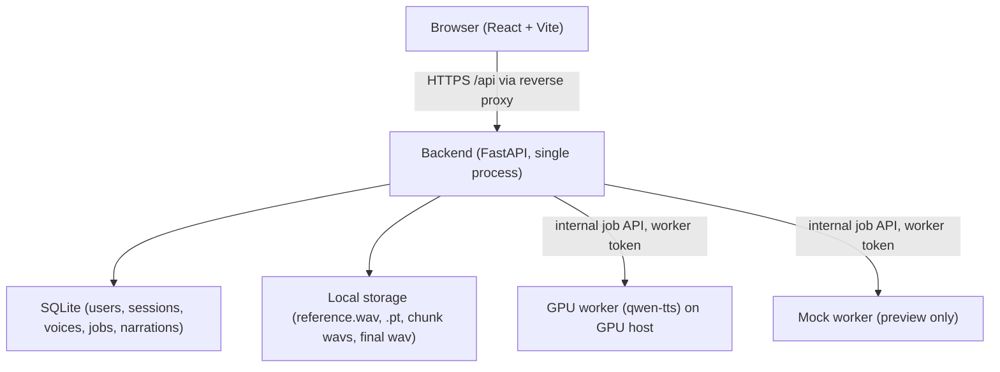

# Voice Studio - Critical Review & Final MVP Architecture

This document is a critical review of `docs/ARCHITECTURE.md` (the v1 proposal) followed by a deliberately minimal MVP architecture. It assumes the requirement set has been updated to include **Google authentication**. No application code is written; this is the design that precedes implementation.

---

## Part 1 - Critical Review of Each Proposed Component

For each component: (1) why it is required, (2) its responsibility, (3) MVP or deferrable, (4) simpler alternative, (5) security considerations.

### 1.1 Frontend (React + Vite)

- **Why required**: A browser UI is the product surface. The workflow is inherently interactive and human-in-the-loop (describe a voice, listen, approve or redesign, then compose scripts and play results).
- **Responsibility**: Auth entry (Google OAuth redirect), voice design form, preview playback + approve/redesign controls, narration script editor with live word/character count, per-chunk job progress, audio playback, WAV download, and generation-history list. Polls the backend; holds no business logic and no secrets.
- **MVP or defer**: Required for MVP. It is the smallest possible client (no API for a CLI).
- **Simpler alternative**: Server-rendered pages (FastAPI + Jinja2) with small vanilla JS or HTMX for polling and playback. This removes the Node build step and the dev-server/proxy dance entirely. It is a legitimate simplification; I keep React+Vite only because it is the established convention here (Vite reverse-proxy and `allowedHosts` rules), it makes the interactive approval flow cleaner, and it does not add security surface if tokens are kept out of the browser.
- **Security considerations**: Never store secrets or access tokens in `localStorage` (XSS theft vector). Render all user text (voice descriptions, reference text, script previews) as plain text, never raw HTML. All data access goes through the backend proxy (`/api`); the frontend never talks to storage or the worker directly. Only httpOnly, `SameSite` cookies are used for sessions (below), which neutralizes the classic JWT-in-localStorage problem.

**Verdict**: Keep React + Vite, but with zero extra layers (no state library, no CSS framework, no websockets; plain polling).

### 1.2 Backend (FastAPI)

- **Why required**: The orchestration hub. It owns all durable state, is the only component that talks to the GPU worker, enforces auth/ownership, and hosts the notebook-proven CPU logic.
- **Responsibility**: Google OAuth session management; voice/narration/job CRUD; script chunking (port of notebook cell 46/55 logic); concatenating chunk WAVs (notebook cell 50); serving audio; the internal worker API (`poll` / `chunks` / `complete` / `fail`).
- **MVP or defer**: Required for MVP.
- **Simpler alternative**: A Node/Express backend would also work, but would require re-deriving and re-testing the chunking and concatenation logic away from the Python reference. Keeping a Python backend lets the notebook code be ported almost verbatim and unit-tested against the same golden inputs, which reduces risk.
- **Security considerations**: Strict request validation (Pydantic); all queries scoped to `owner_id`; secrets only via environment variables; a separate worker token for internal routes; never trust client-supplied identifiers for ownership.

**Verdict**: Keep FastAPI, single process, no Celery/Redis (see 1.5).

### 1.3 Database (v1 proposed PostgreSQL)

- **Why required**: Durable, multi-user data: users, sessions, voices, jobs, narrations. Every feature in the requirement list (accounts, voices, clones, history, progress) is a persisted record.
- **Responsibility**: The single source of truth and the job state store. It does **not** act as a queue directly to the worker (see 1.5); it records job state that the backend manages.
- **MVP or defer**: **Defer PostgreSQL.** For a single web-process MVP running in this environment, **SQLite** is sufficient and zero-ops. PostgreSQL is required only when there are multiple web instances or multiple concurrent workers (its `SKIP LOCKED` row-claiming and connection concurrency matter there).
- **Simpler alternative**: SQLite (used for MVP/dev/test), with the schema written portably (SQLAlchemy) so a later swap to PostgreSQL is a config change, not a rewrite.
- **Security considerations**: Parameterized queries throughout (no string-built SQL); the SQLite file lives outside the web root with restricted file permissions; connection strings come from environment variables.

**Verdict**: Switch MVP to SQLite; PostgreSQL is a documented deployment-time option.

### 1.4 Storage (v1 proposed MinIO/S3)

- **Why required**: Blob artifacts: reference WAVs, `voice_clone_prompt.pt` files, chunk WAVs, final narration WAVs. These are opaque bytes to the web tier.
- **Responsibility**: Durable, retrievable artifact storage keyed by UUID. The backend writes and serves these files; the worker never touches them directly.
- **MVP or defer**: **Defer MinIO/S3.** A local filesystem directory (already covered by `.gitignore`: `storage/`) mirrors the notebook's `voices/` + `output/` layout and needs no infrastructure.
- **Simpler alternative**: A single `storage/` root managed by the backend, with UUID filenames and metadata kept in the database (the DB row holds the relative path).
- **Security considerations**: Files are served only through authenticated endpoints (never static-serving the directory); filenames are server-generated UUIDs, never user-supplied paths; path traversal is impossible by construction; `Content-Disposition` sanitized on download.

**Verdict**: Switch MVP to local filesystem; object storage is a documented production option.

### 1.5 Job queue (v1 proposed DB-backed queue)

- **Why required**: TTS generation is slow (seconds per chunk on a T4) and must not block the HTTP request that submits it. Jobs need enqueue, claim, progress, completion/failure, and retry.
- **Responsibility**: Give every async GPU operation a durable, inspectable state machine: `queued -> running -> succeeded | failed` with progress counters.
- **MVP or defer**: Required for MVP (this is what makes the frontend's progress bar honest), but the **infrastructure is minimal**: a `jobs` table plus a worker poll loop. No broker.
- **Simpler alternative**: The v1 proposal (DB `SKIP LOCKED` claims) is already simple, but it depends on PostgreSQL semantics. Simpler still for MVP: with a **single backend process**, the backend itself claims jobs in memory when the worker calls `POST /internal/jobs/poll` (single claimer, no race). Redis/Celery are deferred entirely.
- **Security considerations**: Only the authenticated worker may call the internal poll/complete endpoints; the frontend may only read its own jobs; error messages are stored server-side and only shown after sanitization.

**Verdict**: Keep the `jobs` table + HTTP poll, claimed in-process by the single backend; defer Redis/Celery.

### 1.6 GPU worker

- **Why required**: This environment has no GPU and the model requires CUDA (both 1.7B checkpoints, ~4-5 GB VRAM each; T4 is the demonstrated baseline). GPU inference is inherently separate.
- **Responsibility**: The only process that runs `qwen-tts`/PyTorch: loads the Base model (resident), loads VoiceDesign on demand, calls `generate_voice_design`, `create_voice_clone_prompt`, and `generate_voice_clone`, and returns WAV/`.pt` bytes to the backend. Single-process serial loop; one job at a time.
- **MVP or defer**: Required for the *real* product, but **not runnable in this environment**. For preview/development a **mock worker** (test double implementing the identical HTTP contract, returning canned WAV bytes) lets the whole web tier be built and demonstrated here. The real worker runs on the user's GPU host (or Colab) against the same contract.
- **Simpler alternative**: A vendor-managed hosted API (DashScope) would remove all GPU infrastructure, but it is not notebook-demonstrated and requires an API key; it is a later option, not MVP.
- **Security considerations**: The worker is outside the web trust zone: it authenticates with a worker token, is never publicly exposed, and returns bytes to the backend rather than reading the database or storage directly. It is the only place model weights exist.

**Verdict**: Keep the thin worker with a strict HTTP contract; use a mock worker for preview; real worker on a GPU host.

### 1.7 Authentication (v1 proposed email+password + JWT)

- **Why required**: The requirement set adds Google authentication and multiple users; every voice/narration must be owned by exactly one user.
- **Responsibility**: Verify Google identity, create/upsert a user record on first login, maintain an authenticated session, gate every endpoint, and enforce per-user ownership.
- **MVP or defer**: Required for MVP. The v1 JWT+refresh-token design is **rejected as over-engineered** for this size and has a worse client-security profile (tokens in browser storage). Switch to **Google OAuth 2.0 Authorization Code + PKCE**, exchanging the code on the backend and issuing a server-side **session** held in an httpOnly, `Secure`, `SameSite=Lax` cookie.
- **Simpler alternative**: The Google OAuth flow itself (one login route, one callback route, upsert user, set cookie, logout deletes the session row). No password hashing, no token refresh machinery, no roles.
- **Security considerations**: Validate the OAuth `state`/PKCE verifier; validate token issuer/audience on the backend; never trust client-submitted identity claims; sessions are revocable (delete the row) and expiring; `SameSite=Lax` plus CSRF-safe design (cookie is not sent on cross-site POSTs; internal worker routes additionally require the worker token); Google OAuth requires a registered redirect URI (https or localhost).

**Verdict**: Replace v1 auth with Google OAuth + server-side sessions; this is both simpler and safer.

### 1.8 Deployment

- **Why required**: The preview environment exposes a single port; both the frontend and backend must run there, and the GPU worker must run somewhere else.
- **Responsibility**: Start the frontend (Vite dev server, reverse-proxying `/api` to the backend) and the backend (FastAPI + SQLite + local storage) for preview; document the production split (web tier container + GPU worker container on a GPU host).
- **MVP or defer**: MVP = a `start.sh` that launches backend + frontend on the exposed port. Production containerization is documented, not built now.
- **Simpler alternative**: In production, FastAPI can serve the Vite build output directly (one process, one port), removing even the Nginx layer for a small app; the reverse proxy exists only in dev.
- **Security considerations**: Expose only the frontend port; never expose the internal worker API; secrets via environment variables with a committed `.env.example` and git-ignored real `.env`; Google OAuth client credentials are user-supplied (the user creates them in Google Cloud Console).

**Verdict**: Keep `start.sh` preview + documented production split; no container stack in MVP.

---

## Part 2 - Decisions Changed From v1

| Decision | v1 proposal | Final MVP | Reason |
| --- | --- | --- | --- |
| Authentication | Email+password, JWT + refresh | Google OAuth (PKCE) + httpOnly session cookie | New requirement; simpler and more secure (revocable sessions, no browser tokens) |
| Database | PostgreSQL | SQLite (portable models) | Single web process, zero-ops; Postgres deferred |
| Storage | MinIO/S3 | Local filesystem `storage/` | No infra needed; object storage deferred |
| Queue | Postgres `SKIP LOCKED` | `jobs` table claimed in-process by single backend | Removes Postgres dependency; no broker |
| Worker I/O | Signed-URL artifact exchange | Worker returns WAV/`.pt` bytes to backend over internal API | Worker never needs storage/DB credentials |
| Frontend | React + Vite + polling | Same, explicitly zero extra layers | Minimal moving parts |
| Worker | Real worker | Mock worker for preview; real worker on GPU host | No GPU here; same HTTP contract |

---

## Part 3 - Final MVP Architecture

### 3.1 Process topology



- **This environment (preview)**: Browser + FastAPI + SQLite + local storage + **mock worker**. Everything demonstrable except real audio synthesis.
- **GPU host (real inference)**: the same backend contract; the **real worker** replaces the mock. No changes to the web tier.

### 3.2 Data model (SQLite, SQLAlchemy)

```
users      (id PK, google_sub UNIQUE, email, name, created_at)
sessions   (id PK, user_id FK, token_hash, expires_at)
voices     (id PK, owner_id FK, name, language, description, reference_text,
            status, reference_audio_path, prompt_pt_path, created_at, updated_at)
jobs       (id PK, owner_id FK, type, status, voice_id, narration_id,
            payload_json, progress, attempts, error, created_at, updated_at)
narrations (id PK, owner_id FK, voice_id, script, chunks_json,
            final_audio_path, sample_rate, duration_sec, status, created_at)
```

`voice.status` flows `designing -> preview_ready -> approved`. `job.status` flows `queued -> running -> succeeded | failed` (retry up to 2 attempts on `narration` chunk failures).

### 3.3 API surface

| Method & path | Auth | Purpose |
| --- | --- | --- |
| `GET /auth/login` | - | Redirect to Google (Authorization Code + PKCE) |
| `GET /auth/callback` | - | Exchange code, upsert user, set session cookie, redirect |
| `POST /auth/logout` | session | Delete session |
| `GET /api/me` | session | Current user |
| `GET /api/voices` `POST /api/voices` | session | List/create own voices |
| `GET /api/voices/{id}` | session, owner | Detail incl. preview audio |
| `POST /api/voices/{id}/design` | session, owner | Enqueue design job (description, ref text, language) |
| `POST /api/voices/{id}/approve` | session, owner | Approve preview; enqueue clone-prompt job |
| `GET /api/narrations` | session | Generation history (own) |
| `POST /api/narrations` | session | Enqueue narration job; backend chunks script |
| `GET /api/narrations/{id}` | session, owner | Detail incl. audio URL and duration |
| `GET /api/jobs/{id}` | session, owner | Job status + progress (polled 2 s) |
| `GET /api/files/{kind}/{id}` | session, owner | Stream WAV (playback or download) |
| `POST /internal/jobs/poll` | worker token | Claim next queued job |
| `POST /internal/jobs/{id}/chunks` | worker token | Upload one generated chunk WAV |
| `POST /internal/jobs/{id}/complete` | worker token | Finish job; attach metadata (sample_rate) |
| `POST /internal/jobs/{id}/fail` | worker token | Report failure with error message |

### 3.4 Data flows (mapped to the notebook)

**Voice design (notebook cells 13-17)**: frontend form -> `POST /api/voices` (draft) -> `POST /api/voices/{id}/design` -> job(design). Worker loads VoiceDesign, calls `generate_voice_design(text=ref_text, language, instruct=description)`, returns preview WAV bytes. Backend stores `reference_audio_path`, sets `preview_ready`. Frontend plays preview; **Approve** -> job(clone_prompt): worker calls `create_voice_clone_prompt(ref_audio=bytes, ref_text)` and returns `.pt` bytes; backend stores `prompt_pt_path`, sets `approved`. **Redesign** -> new design job replaces the preview (notebook's reject-and-edit loop).

**Narration (notebook cells 22-28, 46, 48, 50)**: `POST /api/narrations` with script. Backend runs the notebook chunker (blank-line split, sentence split, greedy 80-word packing), stores `chunks_json`, enqueues job(narration) with the chunk list. Worker restores `VoiceClonePromptItem` from the stored `.pt`, calls `generate_voice_clone` per chunk under `torch.inference_mode()`, uploads each chunk WAV; backend updates `progress = i/total`. On completion the backend concatenates with numpy (verifying a single sample rate) into `final_audio_path`, records `sample_rate`/`duration_sec`, sets narration `status=ready`.

**History**: `GET /api/narrations` lists rows; each row's audio plays/downloads via `GET /api/files/...`.

### 3.5 Authentication flow (Google)

1. `GET /auth/login` redirects to Google with `state` + PKCE challenge.
2. Google redirects to `GET /auth/callback`; backend verifies `state`/verifier, exchanges the code, validates issuer/audience.
3. Upsert `users` by `google_sub`; create a `sessions` row; set `Set-Cookie: session=<token_hash>` httpOnly, Secure, SameSite=Lax.
4. Every `/api/*` route resolves the session cookie to a user; every query filters by `owner_id`.
5. `POST /auth/logout` deletes the session row.

The worker is authenticated separately by a long-lived `WORKER_TOKEN`, not by Google.

### 3.6 Web/GPU boundary (secure separation)

- The worker is the **only** process with model weights and `qwen-tts`.
- The worker authenticates via `WORKER_TOKEN` on `/internal/*` routes; these routes are disabled unless the token is configured, and are not served on the public port.
- The worker never receives database or storage credentials; it receives job payloads and returns bytes.
- The `.pt` prompt is opaque to the web tier: backend stores/retrieves bytes only; only the worker interprets the notebook cell-25 schema.

### 3.7 Security summary (MVP essentials)

- Google OAuth with PKCE; issuer/audience/state validation; no client-side tokens.
- httpOnly Secure SameSite=Lax session cookies; server-side revocation; expiry.
- Ownership enforced on every query and route (worker routes excepted, token-gated).
- Strict Pydantic validation: script length caps, language whitelist, description length caps, empty-script rejection (notebook cell 44).
- UUID artifact names; files served only through authenticated routes.
- Secrets via environment variables; committed `.env.example`, git-ignored `.env`.
- No URL-based reference audio accepted (no SSRF surface).
- Worker never exposed publicly.

### 3.8 Testing (no GPU required)

- Unit: chunker golden tests (ports of notebook cell 46/55 logic, including edge cases: empty script, single sentence, >80-word sentence); concatenation + sample-rate-consistency test (notebook cell 50).
- Unit: prompt schema round-trip (cell-25 dict -> `torch.save` -> `torch.load(weights_only=True)` -> shapes `(108,16)` / `(2048,)`) with CPU torch in CI.
- API: FastAPI TestClient + SQLite; auth, ownership, job lifecycle, file streaming.
- Integration: mock worker proving the internal job contract end-to-end (design -> approve -> prompt -> narration -> playback).
- E2E: Playwright happy path + failure path against the mock worker.
- GPU validation (manual, user's GPU host/Colab): scripted harness identical to notebook cells 1-28; golden WAVs captured.

### 3.9 Preview deployment (`start.sh`)

1. Start FastAPI backend (SQLite, local storage, `WORKER_TOKEN` set, mock worker enabled).
2. Start Vite dev server on the exposed port; proxy `/api` and `/auth` to the backend; `server.allowedHosts` includes `.monkeycode-ai.live`.
3. Note: Google OAuth needs a registered redirect URI for the preview domain (https), provided by the user; until configured, auth screens are reachable but login requires the user's Google Cloud OAuth client.

### 3.10 Explicitly deferred (and never silently added)

- PostgreSQL, MinIO/S3, Redis/Celery, containers, Nginx.
- Roles/permissions, refresh-token rotation, MFA.
- Streaming/low-latency TTS, CustomVoice timbres, batch inference, cloning from uploaded/URL audio, `x_vector_only_mode`, vLLM, DashScope, fine-tuning (none demonstrated in the notebook).
- Multi-GPU scaling, websockets/SSE, audio effects, transcription.

---

## Part 4 - Feature-to-component traceability

| Requirement | Component |
| --- | --- |
| Google authentication | OAuth (PKCE) + sessions (backend, 3.5) |
| User accounts | `users` table, multi-tenant ownership |
| Voice creation/design | design job + VoiceDesign model (worker) |
| Human approval of voices | preview_ready state + approve/redesign endpoints |
| Persistent reusable voice clones | `.pt` prompt artifact + `approved` voice |
| Script input | narration form (frontend), `narrations.script` |
| Automatic 80-word chunking | backend chunker (notebook port) |
| GPU Qwen3-TTS generation | GPU worker (mock in preview) |
| Job/progress status | `jobs` table + poll endpoint + frontend polling |
| Audio playback | `<audio>` over authenticated file route |
| WAV download | same route with download disposition |
| Generation history | `narrations` list endpoint |
| Multiple users | `owner_id` scoping on all records |
| Secure web/GPU separation | worker token + internal-only API + byte-passing contract |
